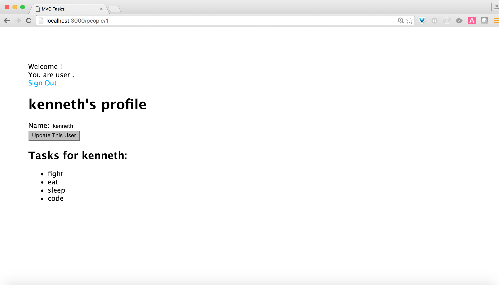

# README For This Project Management Tool App

You'll be extending this project management app. The app uses Node.js, Express.js (framework), MySQL (database) and Handlebars (templating).

You'll be

* adding in delete links for tasks and people. But only if the user is logged in.

* adding in the appropriate route for the delete to work.

* If a person gets deleted, cascade the delete to extend to the tasks that the person owns.

* this is what the main page should look like if a user is signed in:

* you'll also add in this functionality:
  * when clicking a person on the front end, it will take you to a profile for the person showing all the tasks for that person. In addition, you'll be able to edit the person's name and update the person's name. Upon updating, it will redirect you back to this person's profile.
    * After complete The profile page will look like this:

## STEP ONE: READ THROUGH THIS README. FOLLOW THE INSTRUCTIONS

This repository demonstrates the usage of mysql within an express application.

The implemented logic is a simple task tracking tool.

1. create a database called projects_db
  * `mysql -u root`
  * `create database projects_db;`

2. install modules in package.json
  * `npm install`

3. start the application
  * `node server.js`

4. then in the browser go to http://localhost:3000